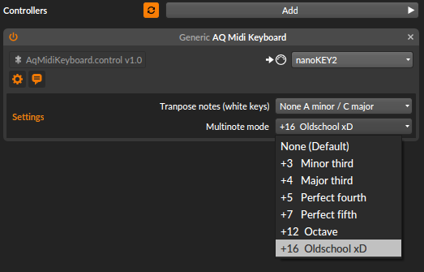

# AQ Midi Keyboard
A simple generic midi keyboard Bitwig controller script with some extra features like transpose notes and multi note mode.

## Install

Just copy `AqMidiKeyboard.contro.js` to following folders:

- Windows: `%USERPROFILE%\Documents\Bitwig Studio\Controller Scripts\`
- Linux / Mac: `~/Documents/Bitwig Studio/Controller Scripts/`

## Transpose notes
It just transpose the notes, so it should be in scale.

## Multinote mode
Simple multinote, so hitting one key will play two notes. Just use the "Perfect fifth" and play some chords :)
   
